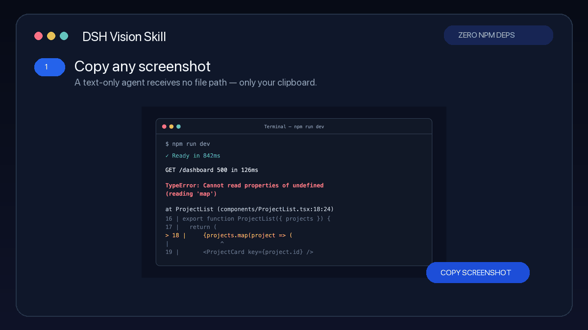

# DSH Vision Skill

Give text-only AI agents eyes. Paste a screenshot, provide a local image, or share an image URL; the skill sends it to Gemini or an OpenAI-compatible vision API and returns useful text.

让纯文本 AI Agent 一键看图：支持剪贴板、本地图片和图片 URL，零 npm 依赖，原图无损传输。

[中文](#中文) · [English](#english)



## 中文

### 为什么使用

- **直接粘贴截图**：不必先保存文件或寻找路径
- **零 npm 依赖**：只需要 Node.js；macOS 和 Windows 使用系统自带工具读取剪贴板
- **准确度优先**：不在本地缩放、压缩或转换图片格式，保留小字和画面细节
- **多种视觉模型**：支持 Gemini 原生 API、阿里云百炼及其他 OpenAI 兼容服务
- **保护本地配置**：API Key 保存在被 Git 忽略的 `.env`；临时图片使用后自动清理

### 一行安装

```bash
git clone --depth 1 https://github.com/shajinhui/dsh-vision-skill ~/.dsh/skills/dsh-vision-skill
```

也可以把仓库复制到项目级目录：`<项目根>/.dsh/skills/dsh-vision-skill/`。DSH 会自动发现 Skill，新会话即可使用。

### 配置

```bash
cd ~/.dsh/skills/dsh-vision-skill
cp .env.example .env
# 编辑 .env，填入 VISION_API_KEY
```

| 服务 | 默认模型 | 配置方式 |
| --- | --- | --- |
| Gemini（推荐） | `gemini-3.1-flash-lite` | 填写 `AIza...` Key，自动使用 Gemini 原生 API |
| 阿里云百炼 | `qwen-vl-max` | 填写百炼 Key，自动使用 OpenAI 兼容接口 |
| 其他兼容服务 | 自定义 | 设置 `VISION_BASE_URL` 和 `VISION_MODEL` |

Gemini Key 可在 [Google AI Studio](https://aistudio.google.com/apikey) 申请；阿里云百炼 Key 可在[百炼控制台](https://bailian.console.aliyun.com/)申请。

### 使用

在 DSH 中直接发送或粘贴图片，然后提问即可。命令行也可以独立使用：

```bash
node vision.js "/绝对路径/screenshot.png" "分析这个报错并给出修复建议"
node vision.js --url "https://example.com/image.jpg" "识别图片中的文字"
node vision.js --clipboard "这个界面有什么问题？"
```

### 原图传输

脚本不会在本地缩放、压缩、重新编码或转换图片格式。本地文件和剪贴板图片会以原始字节进行 Base64 编码；Base64 编码本身不会降低画质。图片 URL 在 OpenAI 兼容服务中直接传给服务端，Gemini 则下载原文件后以内联图片发送。

Base64 内联图片统一设置了 18 MB 的安全上限。超过时脚本会报错并建议改用图片 URL 或服务商支持的文件上传方式，不会擅自压缩原图。

### 平台支持

| 能力 | macOS | Windows | Linux |
| --- | --- | --- | --- |
| 本地图片 / URL | ✅ | ✅ | ✅ |
| 剪贴板图片 | ✅ | ✅ | 暂不支持 |
| 原图无损传输 | ✅ | ✅ | ✅ |

### 安全与隐私

- 图片只会发送给你在 `.env` 中配置的视觉模型服务；项目不包含遥测
- `.env` 已加入 `.gitignore`，请勿在 Issue、日志或提交中粘贴 Key
- 剪贴板产生的临时图片权限受限，并会在成功或失败后清理
- Gemini 本地下载远程图片时，仅允许 HTTP/HTTPS，并限制为最多 5 次重定向和 25 MB

## English

### Install

```bash
git clone --depth 1 https://github.com/shajinhui/dsh-vision-skill ~/.dsh/skills/dsh-vision-skill
cd ~/.dsh/skills/dsh-vision-skill
cp .env.example .env
```

Set `VISION_API_KEY` in `.env`. Keys beginning with `AIza` use the native Gemini API; other keys use the configured OpenAI-compatible endpoint, defaulting to DashScope with `qwen-vl-max`.

### Use

```bash
node vision.js "/absolute/path/screenshot.png" "Find the bug and suggest a fix"
node vision.js --url "https://example.com/image.jpg" "Extract the text"
node vision.js --clipboard "Review this interface"
```

Images are sent without local resizing, recompression, format conversion, or quality loss. Local and clipboard images are Base64-encoded from their original bytes. Images above the inline upload limit fail explicitly instead of being modified.

### Development

```bash
node --check vision.js
node --test tests/*.test.js
swiftc -typecheck clipboard.swift  # macOS
```

## License

[MIT](LICENSE)
